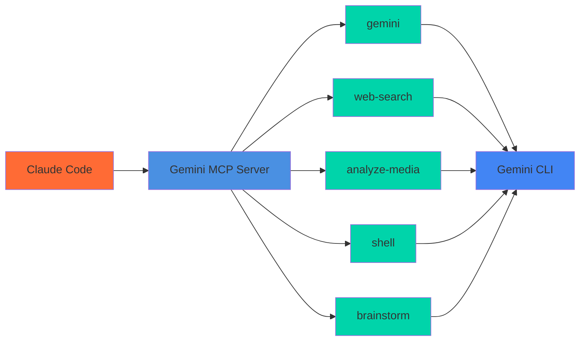

# Gemini MCP Server

[](https://www.npmjs.com/package/@tuannvm/gemini-mcp-server)
[](https://www.npmjs.com/package/@tuannvm/gemini-mcp-server)
[](https://www.npmjs.com/package/@tuannvm/gemini-mcp-server)

Give Claude superpowers with Gemini's massive context window. Analyze entire codebases, search the web, process images, and brainstorm ideas—all through MCP.



## Quick Start

### Prerequisites

1. **Install Gemini CLI**: `npm install -g @google/gemini-cli`
2. **Authenticate**: Run `gemini` and login with Google (free: 60 req/min, 1000 req/day)
3. **Set default model** (recommended): `export GEMINI_MODEL="gemini-3-pro-preview"`

### Install

#### One-Click

[](https://vscode.dev/redirect/mcp/install?name=gemini-cli&config=%7B%22type%22%3A%22stdio%22%2C%22command%22%3A%22npx%22%2C%22args%22%3A%5B%22-y%22%2C%22%40tuannvm%2Fgemini-mcp-server%22%5D%7D)
[](https://insiders.vscode.dev/redirect/mcp/install?name=gemini-cli&config=%7B%22type%22%3A%22stdio%22%2C%22command%22%3A%22npx%22%2C%22args%22%3A%5B%22-y%22%2C%22%40tuannvm%2Fgemini-mcp-server%22%5D%7D)
[](https://cursor.com/en/install-mcp?name=gemini-cli&config=eyJ0eXBlIjoic3RkaW8iLCJjb21tYW5kIjoibnB4IC15IEB0dWFubnZtL2dlbWluaS1tY3Atc2VydmVyIiwiZW52Ijp7fX0=)

#### Manual

```bash
# Claude Code
claude mcp add gemini-cli -- npx -y @tuannvm/gemini-mcp-server
```

<details>
<summary>Claude Desktop</summary>

Add to `~/Library/Application Support/Claude/claude_desktop_config.json` (macOS) or `%APPDATA%/Claude/claude_desktop_config.json` (Windows):

```json
{
  "mcpServers": {
    "gemini-cli": {
      "command": "npx",
      "args": ["-y", "@tuannvm/gemini-mcp-server"]
    }
  }
}
```
</details>

## What You Can Do

| Tool | What it does |
|------|--------------|
| **gemini** | Analyze files and codebases with Gemini's 1M+ token context |
| **web-search** | Search the web with Google Search grounding |
| **analyze-media** | Process images, PDFs, and screenshots |
| **shell** | Generate and execute shell commands |
| **brainstorm** | Creative ideation with structured methodologies |

## Examples

```
# Analyze an entire codebase
Use gemini to analyze @. and provide an architecture overview

# Compare files
Use gemini to compare @src/old.ts and @src/new.ts

# Search the web
Use web-search to find the latest React 19 features

# Analyze a screenshot
Use analyze-media with filePath "@error.png" and prompt "what's this error?"

# Brainstorm ideas
Use brainstorm with methodology "design-thinking" to improve user onboarding
```

## Documentation

- **[API Reference](docs/api-reference.md)** — Full tool parameters and options
- **[Gemini CLI Integration](docs/gemini-cli-integration.md)** — Setup, models, and troubleshooting
- **[Documentation Site](https://tuannvm.github.io/gemini-mcp-server/)**

## Development

```bash
npm install    # Install dependencies
npm run dev    # Development mode
npm run build  # Build
npm test       # Run tests
```

## Acknowledgments

Inspired by [gemini-mcp-tool](https://github.com/jamubc/gemini-mcp-tool).

## License

MIT — This is an unofficial tool, not affiliated with Google.
