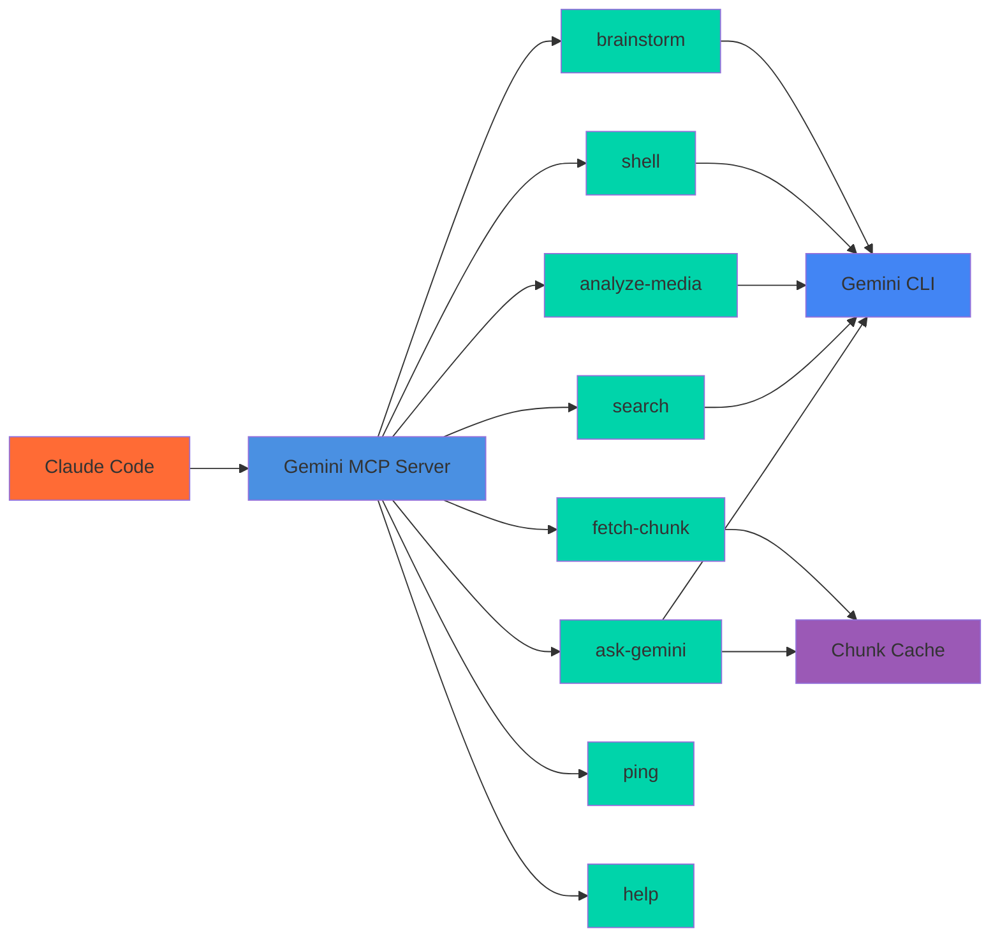

# Gemini MCP Server

[](https://www.npmjs.com/package/gemini-mcp-tool)
[](https://www.npmjs.com/package/gemini-mcp-tool)
[](https://www.npmjs.com/package/gemini-mcp-tool)

MCP server for Google Gemini CLI integration with large file analysis, web search, multimodal analysis, shell commands, and brainstorming support.



## Prerequisites

- **Google Gemini CLI v0.22.2+** must be pre-installed and configured
  - Install: `npm install -g @google/gemini-cli`
  - Authenticate: Run `gemini` and login with Google (free tier: 60 req/min, 1000 req/day)
  - Or set API key: `export GEMINI_API_KEY="YOUR_API_KEY"`
  - **Recommended**: Set default model to Gemini 3 Pro (see [Model Configuration](#model-configuration))
- **Node.js v18+** installed
- **Claude Code** or compatible MCP client

## Installation

### One-Click Installation

#### VS Code
[](https://vscode.dev/redirect/mcp/install?name=gemini-cli&config=%7B%22type%22%3A%22stdio%22%2C%22command%22%3A%22npx%22%2C%22args%22%3A%5B%22-y%22%2C%22gemini-mcp-tool%22%5D%7D)

#### VS Code Insiders
[](https://insiders.vscode.dev/redirect/mcp/install?name=gemini-cli&config=%7B%22type%22%3A%22stdio%22%2C%22command%22%3A%22npx%22%2C%22args%22%3A%5B%22-y%22%2C%22gemini-mcp-tool%22%5D%7D)

#### Cursor
[](https://cursor.com/en/install-mcp?name=gemini-cli&config=eyJ0eXBlIjoic3RkaW8iLCJjb21tYW5kIjoibnB4IC15IGdlbWluaS1tY3AtdG9vbCIsImVudiI6e319)

### Manual Installation

#### Claude Code
```bash
claude mcp add gemini-cli -- npx -y gemini-mcp-tool
```

#### Claude Desktop
Add to your Claude Desktop configuration file:

**macOS:** `~/Library/Application Support/Claude/claude_desktop_config.json`

**Windows:** `%APPDATA%/Claude/claude_desktop_config.json`

```json
{
  "mcpServers": {
    "gemini-cli": {
      "command": "npx",
      "args": ["-y", "gemini-mcp-tool"]
    }
  }
}
```

## Usage in Claude Code

Once installed, Claude Code can use these tools:

### `ask-gemini` - File Analysis & Questions
Analyze files and codebases using Gemini's large context window with the `@` syntax.

**Basic Usage:**
```
Use ask-gemini to analyze @src/main.js and explain what it does
```

**Advanced Usage:**
```
# Model selection (defaults to gemini-3-pro-preview)
Use ask-gemini with model "gemini-3-flash-preview" to quickly summarize @package.json

# Sandbox mode for safe code execution
Use ask-gemini with sandbox true to test @script.py safely

# Change mode for structured edits
Use ask-gemini with changeMode true to refactor @src/utils.ts
```

**Parameters:**
- `prompt` (required): Your question or analysis request. Use `@` syntax for file references
- `model` (optional): Model to use (`gemini-3-pro-preview` or `gemini-3-flash-preview`)
- `sandbox` (optional): Enable sandbox mode for safe execution
- `changeMode` (optional): Enable structured edit mode for code changes

### `search` - Web Search with Google Grounding
Search the web using Gemini with Google Search grounding for real-time information.

**Basic Usage:**
```
Use search to find the latest React 19 features
```

**Advanced Usage:**
```
# Get raw results without summarization
Use search with query "kubernetes security best practices 2025" and summarize false

# Use specific model
Use search with query "latest AI news" and model "gemini-3-pro-preview"
```

**Parameters:**
- `query` (required): Search query
- `summarize` (optional): Summarize results (default: true)
- `model` (optional): Model to use (default: gemini-3-flash-preview for speed)

### `analyze-media` - Multimodal Analysis
Analyze images, PDFs, screenshots, and diagrams using Gemini's multimodal capabilities.

**Basic Usage:**
```
Use analyze-media with filePath "@screenshot.png" and prompt "describe this UI"
```

**Advanced Usage:**
```
# Detailed analysis
Use analyze-media with filePath "@architecture.pdf" and prompt "explain the system design" and detailed true

# Quick analysis with Flash model
Use analyze-media with filePath "@error.png" and prompt "what's the error?" and model "gemini-3-flash-preview"
```

**Parameters:**
- `filePath` (required): Path to media file (use `@` syntax)
- `prompt` (required): What to analyze or extract
- `model` (optional): Model to use (default: gemini-3-pro-preview for multimodal)
- `detailed` (optional): Provide detailed analysis

### `shell` - Shell Command Generation
Generate and optionally execute shell commands using Gemini.

**Basic Usage:**
```
Use shell with task "find all TypeScript files larger than 100KB"
```

**Advanced Usage:**
```
# Dry run (default) - explains commands without executing
Use shell with task "clean up node_modules and rebuild" and dryRun true

# Execute in sandbox (safe)
Use shell with task "run the test suite" and dryRun false

# With working directory
Use shell with task "list all TODO comments" and workingDirectory "@src/"
```

**Parameters:**
- `task` (required): Description of the shell task
- `dryRun` (optional): If true, explains commands without executing (default: true)
- `workingDirectory` (optional): Working directory for execution
- `model` (optional): Model to use (default: gemini-3-flash-preview)

### `brainstorm` - Creative Ideation
Generate ideas using various brainstorming methodologies.

**Basic Usage:**
```
Use brainstorm to generate ideas for improving user onboarding
```

**Advanced Usage:**
```
# Specific methodology
Use brainstorm with methodology "SCAMPER" to improve the checkout flow

# Domain-specific brainstorming
Use brainstorm with domain "mobile" and ideaCount 10 for app features

# With analysis
Use brainstorm with includeAnalysis true to evaluate idea feasibility
```

**Parameters:**
- `prompt` (required): The brainstorming topic
- `methodology` (optional): Framework to use (`divergent`, `convergent`, `SCAMPER`, `design-thinking`, `lateral`, `auto`)
- `domain` (optional): Domain context for specialized ideas
- `constraints` (optional): Known limitations or requirements
- `ideaCount` (optional): Target number of ideas to generate
- `includeAnalysis` (optional): Include feasibility and impact analysis

### `fetch-chunk` - Retrieve Cached Chunks
Retrieve cached chunks from large changeMode responses.

**Parameters:**
- `cacheKey` (required): Cache key from previous response
- `chunkIndex` (required): Chunk index to retrieve (1-based)

### `ping` - Connection Test
Test if the MCP server is working properly.

### `help` - Gemini CLI Help
Get information about Gemini CLI capabilities and commands.

## Example Workflows

**Large Codebase Analysis:**
```
Use ask-gemini to analyze @. and provide an architecture overview
```

**File Comparison:**
```
Use ask-gemini to compare @src/old.ts and @src/new.ts and explain the differences
```

**Code Refactoring with Structured Edits:**
```
Use ask-gemini with changeMode true to refactor @src/utils.ts for better error handling
```

**Creative Brainstorming:**
```
Use brainstorm with methodology "design-thinking" to improve the user dashboard experience
```

**Web Research:**
```
Use search to find the latest security vulnerabilities in npm packages
```

**Screenshot Analysis:**
```
Use analyze-media with filePath "@error-screenshot.png" and prompt "explain this error and suggest a fix"
```

**Shell Task Automation:**
```
Use shell with task "find all files modified in the last 24 hours" and dryRun false
```

## Advanced Features

### Large File Handling
- Gemini's massive context window handles large files that would exceed other models' limits
- Use `@` syntax to reference files: `@src/main.js`, `@.` (current directory)
- Automatic chunking for very large responses with cache retrieval

### Change Mode (Structured Edits)
When `changeMode` is enabled, responses are formatted as structured edits that can be automatically applied:
- Parses `**FILE: path:line**` format with `OLD/NEW` blocks
- Chunks large edit responses for manageable processing
- 10-minute cache TTL for chunk retrieval

### Model Fallback
- Automatically falls back from `gemini-3-pro-preview` to `gemini-3-flash-preview` when quota is exceeded
- Transparent retry with status notification

### Progress Notifications
For long-running operations, the server sends `notifications/progress` messages when the client provides a `progressToken`.

## Model Configuration

### Setting the Default Model

You can configure the default Gemini model using three methods (in order of precedence):

**1. Environment Variable (Recommended)**
```bash
export GEMINI_MODEL="gemini-3-pro-preview"
```

**2. Settings File**

Create `~/.gemini/settings.json` (user-level) or `.gemini/settings.json` (project-level):
```json
{
  "model": {
    "name": "gemini-3-pro-preview"
  }
}
```

**3. Command-Line Flag**
```bash
gemini -m gemini-3-pro-preview
```

### Available Models

| Model | ID | Best For |
|-------|-----|----------|
| **Gemini 3 Pro** (default) | `gemini-3-pro-preview` | Most capable, complex reasoning |
| **Gemini 3 Flash** | `gemini-3-flash-preview` | Fast responses, good quality |
| Gemini 2.5 Flash-Lite | `gemini-2.5-flash-lite` | Fastest, lightweight |

### Configuration Precedence

Settings are applied in order (highest priority last):
1. Default values
2. User settings file (`~/.gemini/settings.json`)
3. Project settings file (`.gemini/settings.json`)
4. Environment variables (`GEMINI_MODEL`)
5. Command-line arguments (`-m`)
6. MCP tool `model` parameter (overrides all)

### Recommended Setup

For best results, set Gemini 3 Pro as your default:

```bash
# Add to your shell profile (~/.bashrc, ~/.zshrc, etc.)
export GEMINI_MODEL="gemini-3-pro-preview"
```

Or create a user settings file:
```bash
mkdir -p ~/.gemini
echo '{"model": {"name": "gemini-3-pro-preview"}}' > ~/.gemini/settings.json
```

## Development

```bash
# Install dependencies
npm install

# Development mode
npm run dev

# Build
npm run build

# Run tests
npm test

# Lint and format
npm run lint
npm run format
```

## Documentation

- [API Reference](docs/api-reference.md)
- [Gemini CLI Integration](docs/gemini-cli-integration.md)
- [Full Documentation Site](https://jamubc.github.io/gemini-mcp-tool/)

## License

MIT

**Disclaimer:** This is an unofficial, third-party tool and is not affiliated with, endorsed, or sponsored by Google.
