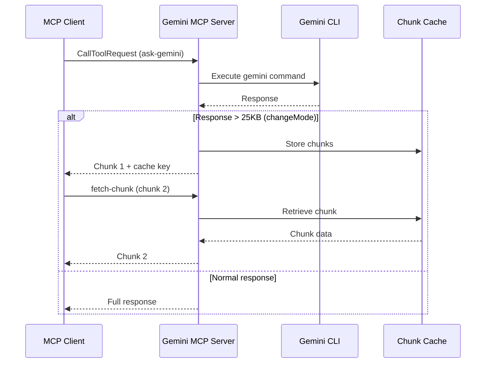

# API Reference

Complete API documentation for Gemini MCP Server tools.

## Tools

### ask-gemini

Analyze files and ask questions using Google Gemini CLI.

**Input Schema:**
```json
{
  "type": "object",
  "properties": {
    "prompt": {
      "type": "string",
      "description": "The analysis request. Use @ syntax to include files (e.g., @src/main.js)"
    },
    "model": {
      "type": "string",
      "description": "Gemini model to use",
      "enum": ["gemini-3-pro-preview", "gemini-3-flash-preview"],
      "default": "gemini-3-pro-preview"
    },
    "sandbox": {
      "type": "boolean",
      "description": "Enable sandbox mode for safe code execution",
      "default": false
    },
    "changeMode": {
      "type": "boolean",
      "description": "Enable structured edit mode for code changes",
      "default": false
    },
    "chunkIndex": {
      "type": "number",
      "description": "Which chunk to return (1-based) for large responses"
    },
    "chunkCacheKey": {
      "type": "string",
      "description": "Cache key for continuation of chunked responses"
    }
  },
  "required": ["prompt"]
}
```

**Response:**
- Returns Gemini's analysis as text
- In changeMode, returns structured edits with chunk info if response is large

**Example:**
```json
{
  "name": "ask-gemini",
  "arguments": {
    "prompt": "@src/index.ts explain this code",
    "model": "gemini-3-pro-preview",
    "sandbox": false
  }
}
```

---

### search

Search the web using Gemini with Google Search grounding.

**Input Schema:**
```json
{
  "type": "object",
  "properties": {
    "query": {
      "type": "string",
      "description": "Search query to find information on the web"
    },
    "summarize": {
      "type": "boolean",
      "description": "Summarize the search results",
      "default": true
    },
    "model": {
      "type": "string",
      "description": "Model to use (default: gemini-3-flash-preview for speed)"
    }
  },
  "required": ["query"]
}
```

**Response:**
- Returns search results with optional summarization

**Example:**
```json
{
  "name": "search",
  "arguments": {
    "query": "latest React 19 features",
    "summarize": true
  }
}
```

---

### analyze-media

Analyze images, PDFs, or other media files using Gemini multimodal capabilities.

**Input Schema:**
```json
{
  "type": "object",
  "properties": {
    "filePath": {
      "type": "string",
      "description": "Path to the media file (use @ syntax)"
    },
    "prompt": {
      "type": "string",
      "description": "What to analyze or extract from the media"
    },
    "model": {
      "type": "string",
      "description": "Model to use (default: gemini-3-pro-preview)"
    },
    "detailed": {
      "type": "boolean",
      "description": "Provide detailed analysis",
      "default": false
    }
  },
  "required": ["filePath", "prompt"]
}
```

**Response:**
- Returns analysis of the media file

**Example:**
```json
{
  "name": "analyze-media",
  "arguments": {
    "filePath": "@screenshot.png",
    "prompt": "describe this UI and suggest improvements",
    "detailed": true
  }
}
```

---

### shell

Generate and optionally execute shell commands using Gemini.

**Input Schema:**
```json
{
  "type": "object",
  "properties": {
    "task": {
      "type": "string",
      "description": "Description of the shell task to perform"
    },
    "workingDirectory": {
      "type": "string",
      "description": "Working directory for execution (use @ syntax)"
    },
    "dryRun": {
      "type": "boolean",
      "description": "If true, explains commands without executing",
      "default": true
    },
    "model": {
      "type": "string",
      "description": "Model to use (default: gemini-3-flash-preview)"
    }
  },
  "required": ["task"]
}
```

**Response:**
- In dry-run mode: Returns command explanations
- In execute mode: Returns execution results (sandbox)

**Example:**
```json
{
  "name": "shell",
  "arguments": {
    "task": "find all TODO comments in TypeScript files",
    "workingDirectory": "@src/",
    "dryRun": true
  }
}
```

---

### brainstorm

Generate ideas using various brainstorming methodologies.

**Input Schema:**
```json
{
  "type": "object",
  "properties": {
    "prompt": {
      "type": "string",
      "description": "The brainstorming topic"
    },
    "methodology": {
      "type": "string",
      "description": "Brainstorming framework to use",
      "enum": ["divergent", "convergent", "SCAMPER", "design-thinking", "lateral", "auto"],
      "default": "auto"
    },
    "domain": {
      "type": "string",
      "description": "Domain context for specialized ideas"
    },
    "constraints": {
      "type": "string",
      "description": "Known limitations or requirements"
    },
    "existingContext": {
      "type": "string",
      "description": "Background information to build upon"
    },
    "ideaCount": {
      "type": "number",
      "description": "Target number of ideas to generate",
      "default": 5
    },
    "includeAnalysis": {
      "type": "boolean",
      "description": "Include feasibility and impact analysis",
      "default": false
    }
  },
  "required": ["prompt"]
}
```

**Response:**
- Returns generated ideas with optional analysis scores

**Example:**
```json
{
  "name": "brainstorm",
  "arguments": {
    "prompt": "Ways to improve user onboarding",
    "methodology": "SCAMPER",
    "ideaCount": 10,
    "includeAnalysis": true
  }
}
```

---

### fetch-chunk

Retrieve cached chunks from large changeMode responses.

**Input Schema:**
```json
{
  "type": "object",
  "properties": {
    "cacheKey": {
      "type": "string",
      "description": "Cache key from previous response"
    },
    "chunkIndex": {
      "type": "number",
      "description": "Chunk index to retrieve (1-based)"
    }
  },
  "required": ["cacheKey", "chunkIndex"]
}
```

**Response:**
- Returns the requested chunk content

**Example:**
```json
{
  "name": "fetch-chunk",
  "arguments": {
    "cacheKey": "abc123-def456",
    "chunkIndex": 2
  }
}
```

---

### ping

Test MCP server connection.

**Input Schema:**
```json
{
  "type": "object",
  "properties": {
    "message": {
      "type": "string",
      "description": "Optional message to echo back"
    }
  }
}
```

**Response:**
- Echoes back the message or default "pong"

---

### help

Get Gemini CLI help information.

**Input Schema:**
```json
{
  "type": "object",
  "properties": {}
}
```

**Response:**
- Returns Gemini CLI help text

---

## MCP Protocol

### Server Capabilities

```json
{
  "capabilities": {
    "tools": {},
    "prompts": {},
    "notifications": {},
    "logging": {}
  }
}
```

### Progress Notifications

For long-running operations, the server sends progress notifications:

```json
{
  "method": "notifications/progress",
  "params": {
    "progressToken": "<token>",
    "progress": 50,
    "message": "Processing ask-gemini - Gemini is analyzing your request..."
  }
}
```

Progress notifications are sent every 25 seconds during execution.

### Error Handling

Errors are returned in the standard MCP format:

```json
{
  "content": [
    {
      "type": "text",
      "text": "Error executing ask-gemini: <error message>"
    }
  ],
  "isError": true
}
```

## Architecture


