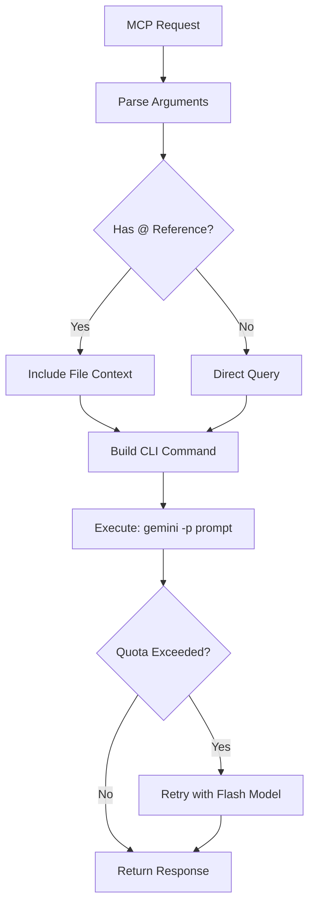
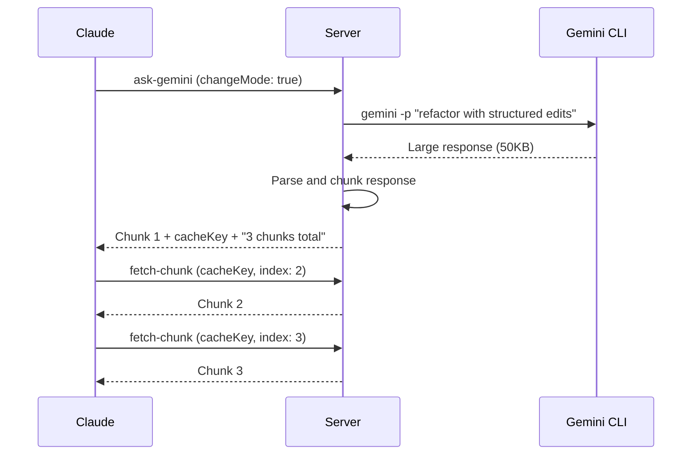

# Gemini CLI Integration

This document explains how the Gemini MCP Server integrates with the Google Gemini CLI.

## Prerequisites

### Gemini CLI Installation

The Gemini CLI must be installed and authenticated before using this MCP server.

```bash
# Install Gemini CLI globally
npm install -g @google/gemini-cli

# Or try without installing
npx @google/gemini-cli
```

### Authentication

**Option 1: Google Login (Free Tier)**
```bash
# Start gemini and follow OAuth flow
gemini

# Free tier limits: 60 requests/min, 1000 requests/day
```

**Option 2: API Key**
```bash
# Get key from https://aistudio.google.com/
export GEMINI_API_KEY="YOUR_API_KEY"
```

Credentials are stored locally for subsequent CLI access.

## Command Execution

### Basic Flow



### CLI Flags Used

| Flag | Description | Example |
|------|-------------|---------|
| `-p` | Prompt/query | `gemini -p "explain this code"` |
| `-m` | Model selection | `gemini -m gemini-3-flash-preview` |
| `-s` | Sandbox mode | `gemini -s -p "run this code"` |

### Model Selection

**Default Model:** `gemini-3-pro-preview`

**Available Models:**
- `gemini-3-pro-preview` - Most capable, complex reasoning (Gemini 3)
- `gemini-3-flash-preview` - Fast, good quality (Gemini 3)
- `gemini-2.5-flash-lite` - Fastest, lightweight

**Automatic Fallback:**
When `gemini-3-pro-preview` quota is exceeded, the server automatically retries with `gemini-3-flash-preview`.

## File Reference Syntax

The `@` syntax allows referencing files in prompts:

| Syntax | Description |
|--------|-------------|
| `@file.ts` | Single file |
| `@src/` | Directory |
| `@.` | Current directory |
| `@src/*.ts` | Glob pattern |

**Examples:**
```
@src/index.ts explain this code
@. provide an architecture overview
@package.json list the dependencies
```

## Sandbox Mode

Sandbox mode (`-s` flag) provides isolated execution:

- Safe code execution environment
- No persistent file system changes
- Ideal for testing untrusted code

**Usage:**
```json
{
  "name": "ask-gemini",
  "arguments": {
    "prompt": "@script.py run this safely",
    "sandbox": true
  }
}
```

## Change Mode (Structured Edits)

When `changeMode` is enabled, responses are formatted for automatic code application:

### Format

```
**FILE: src/utils.ts:15**
<<<<<<< OLD
function oldCode() {
  return "old";
}
=======
function newCode() {
  return "new";
}
>>>>>>> NEW
```

### Chunking

Large responses (>25KB) are automatically chunked:

1. First response includes chunk 1 + cache key + total chunks
2. Use `fetch-chunk` tool to retrieve remaining chunks
3. Cache expires after 10 minutes

### Example Flow



## Error Handling

### Quota Exceeded

When Pro model quota is exceeded:

```
RESOURCE_EXHAUSTED: Quota exceeded for quota metric 'Gemini 2.5 Pro Requests'
```

**Automatic Recovery:**
1. Server detects quota error
2. Logs: "Gemini 2.5 Pro quota exceeded, switching to Flash model..."
3. Retries request with `gemini-3-flash-preview`
4. Returns response with fallback note

### Common Errors

| Error | Cause | Solution |
|-------|-------|----------|
| `Command not found: gemini` | CLI not installed | Install Gemini CLI |
| `Not authenticated` | No auth credentials | Run `gemini auth login` |
| `RESOURCE_EXHAUSTED` | API quota limit | Wait or use Flash model |
| `File not found` | Invalid @ reference | Check file path |

## Performance Considerations

### Context Window

Gemini models support large context windows:
- `gemini-3-pro-preview`: Large context window
- `gemini-3-flash-preview`: Large context window

This enables analysis of:
- Large codebases
- Multiple files simultaneously
- Entire project directories

### Latency

Typical response times:
- Simple queries: 2-5 seconds
- File analysis: 5-15 seconds
- Large codebase: 30-120 seconds

Progress notifications are sent every 25 seconds to keep the connection alive.

## Troubleshooting

### Debug Logging

The server logs with `[GMCP]` prefix:

```
[GMCP] Executing: gemini -m gemini-3-pro-preview -p "@src/index.ts explain"
[GMCP] Response received (2.3s)
```

### Common Issues

**1. Gemini CLI not found**
```bash
# Verify installation
which gemini

# Reinstall if needed
npm install -g @anthropic/gemini-cli
```

**2. Authentication expired**
```bash
# Re-authenticate
gemini auth login
```

**3. Slow responses**
- Large files take longer to process
- Progress notifications indicate the server is working
- Consider using `gemini-3-flash-preview` for faster responses
